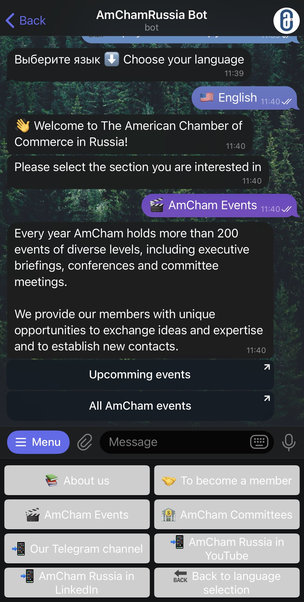

# PodcastCourseBot 📚🎙️

Telegram-бот-курс «Подкаст за 7 шагов»: пошаговый прогресс, тест и PDF-сертификат.  

🖥️ Продакшн-версия работает на приватном VPS (бот доступен 24/7).  
🔒 В репозитории — только витрина: код, requirements, README и CI.  
👉 Попробовать вживую: [t.me/PodcastCourseBot](https://t.me/PodcastCourseBot)

---

## Функции
- Пошаговая навигация и сохранение прогресса  
- Финальный тест и генерация PDF-сертификата (fpdf)  
- Админ-команды, меню, обработка ошибок  

## Технологии
Python · python-telegram-bot v20 · fpdf2 · asyncio  

---

## Demo

> См. [PORTFOLIO_ONLY.md](PORTFOLIO_ONLY.md) для пояснения.

> English version: [README_EN.md](README_EN.md)
